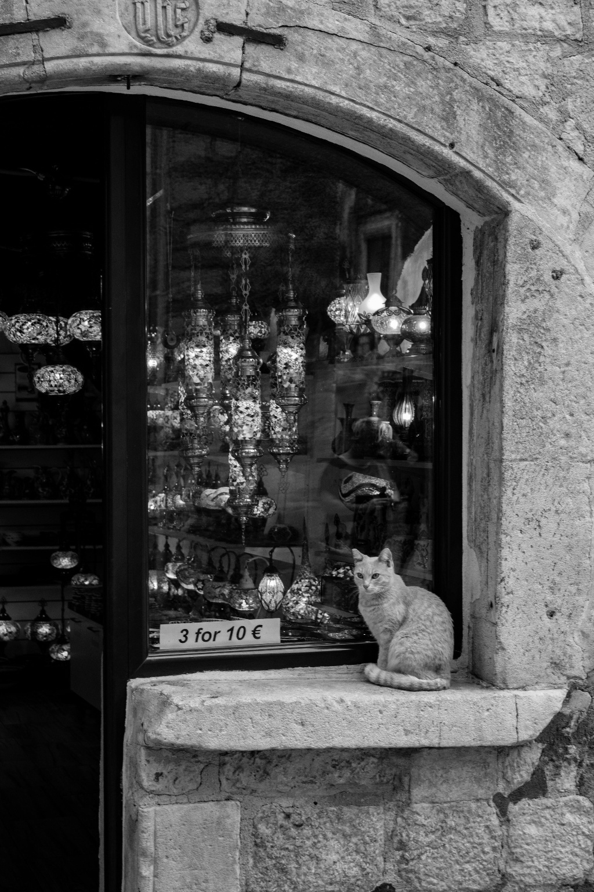
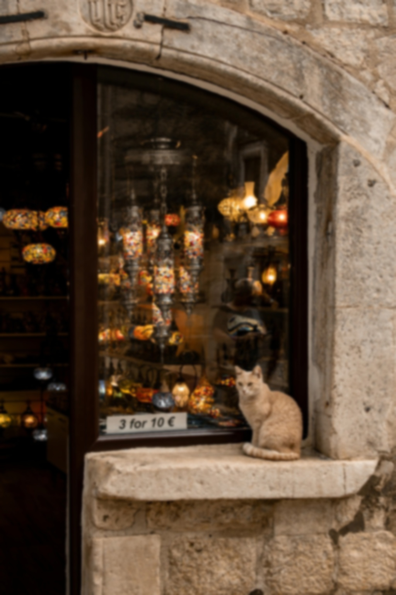
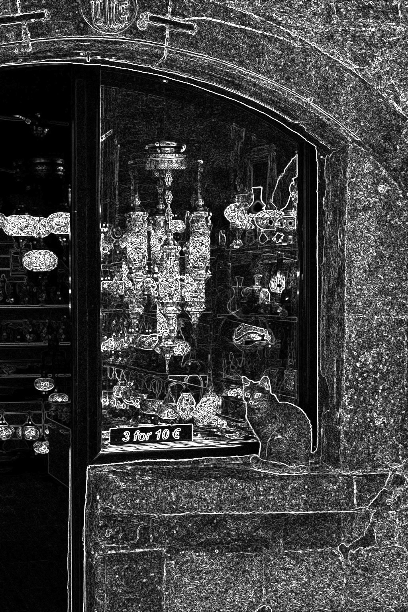

# Image Processing Lib

Lightweight C++ image-processing library using OpenCV. Includes a small example `demo` that
loads an image and applies several simple filters (grayscale, Gaussian blur, Sobel edges).

**Contents**
- `include/` — public headers (`image.hpp`, `filters.hpp`)
- `src/` — implementation (`image.cpp`, `filters.cpp`)
- `examples/demo.cpp` — command-line demo application
- `assets/` — test images
- `build/` — CMake build output

**Requirements**
- macOS or Linux
- CMake >= 3.10
- A C++17-capable compiler (Clang or GCC)
- OpenCV (we use the Homebrew package name `opencv` on macOS)

Quick install on macOS (if OpenCV is missing):

```bash
# Install Homebrew (if you don't have it): https://brew.sh/
brew install opencv
```

Note: if `brew install opencv` fails due to Qt conflicts, run `brew unlink qt` and retry.

**Build**

```bash
mkdir -p build
cd build
cmake ..
make -j
```

This produces a static library `libimgproc.a` and an executable `demo` in `build/`.

**Demo / Usage**

Simple usage (creates 3 files with `_gray`, `_blur`, `_edges` suffixes):

```bash
./build/demo <input_image> [output_prefix]
# Example:
./build/demo assets/test_input_small.jpg assets/filtered

# Produces: assets/filtered_gray.jpg, assets/filtered_blur.jpg, assets/filtered_edges.jpg
```
**Sample results (generated by the demo above)**

- Input (`assets/test_input_small.jpg`)


- Grayscale (`assets/filtered_gray.jpg`)



- Gaussian blur (`assets/filtered_blur.jpg`)



- Sobel edges (`assets/filtered_edges.jpg`)




Available filters implemented in `Filters`:
- `toGray` — converts to grayscale (output saved as 3-channel BGR image for compatibility)
- `gaussianBlur` — Gaussian blur; kernel size can be adjusted inside source or extended to CLI
- `sobelEdge` — Sobel edge magnitude image

**Notes & Troubleshooting**
- If VS Code reports missing include errors for OpenCV, add the OpenCV include path to
	`.vscode/c_cpp_properties.json`. On Homebrew installs the include path is typically:
	`/opt/homebrew/opt/opencv/include/opencv4` (arm64) or `/usr/local/opt/opencv/include/opencv4` (intel).
- Large images may cause the demo to be killed due to memory usage. Two options:
	- Resize the input before processing (e.g. use `cv::resize` in a preprocessing step).
	- Implement tiled processing to handle images in chunks (future work).

**Next improvements you can request**
- CLI flags (`--gray`, `--blur N`, `--sobel`, `--resize WxH`, `--png`)
- Pipeline via JSON/YAML config
- Batch processing and parallelization
- Tiling support for very large images

If you'd like, I can add any of these features — tell me which one and I'll implement it.
